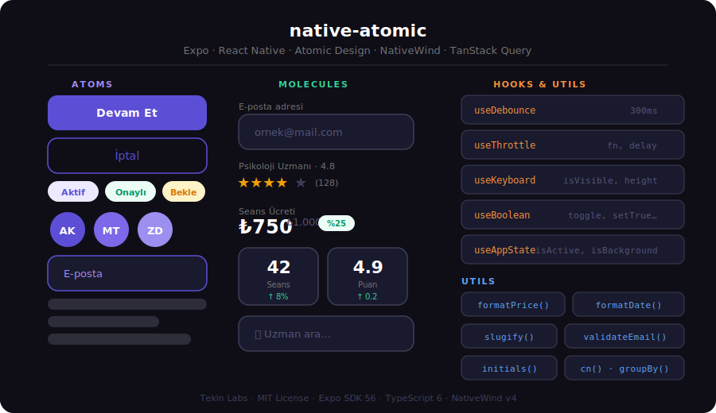

# native-atomic

> **Production-ready Atomic Design core for Expo / React Native.**  
> Copy once, use everywhere — a project-agnostic UI foundation built with NativeWind v4, TanStack Query v5, Zustand v5, and Zod v4.



---

## What Is This?

`native-atomic` is a **reusable core layer** for Expo projects that gives you:

| Layer | What you get |
|---|---|
| **Atoms** | Button, Text, Input, Badge, Chip, Avatar, Icon, Divider, Skeleton |
| **Molecules** | InputField, SearchBar, RatingRow, PriceDisplay, StatCard, IconButton |
| **Hooks** | useDebounce, useThrottle, useKeyboard, useBoolean, useAppState, useMount, usePrevious, useUnmount |
| **Utils** | formatPrice, formatDate, cn, truncate, slugify, initials, groupBy, uniqueBy, isEmail, isPhone |
| **Lib** | Axios instance (JWT refresh, 401/422 handling), TanStack Query client, MMKV storage, typed env |
| **Auth store** | Zustand + MMKV persist slice with role-based state |

Everything is **TypeScript-strict**, **zero `any`**, **Zod-validated** at API boundaries, and has **≥ 95% test coverage** on all atoms and utilities.

---

## Tech Stack

| Tool | Version | Role |
|---|---|---|
| Expo | ~56 | Build & bundler |
| React Native | 0.85 | Runtime |
| Expo Router | ~56.2 | File-based navigation |
| NativeWind | ^4.2 | Tailwind CSS for RN |
| TanStack Query | ^5 | Server state |
| Zustand | ^5 | Global UI state |
| Zod | ^4 | Schema validation |
| React Hook Form | ^7 | Form state |
| MMKV | ^4 | Persistent storage |
| Reanimated | 4.3 | Animations |
| TypeScript | ~6 | Type safety |
| Jest | ^29 | Testing |

---

## Quick Start

### 1 — Clone and install

```bash
git clone https://github.com/tekin-labs/native-atomic.git my-app
cd my-app
npm install
```

### 2 — Configure your environment

```bash
cp .env.example .env
# Set EXPO_PUBLIC_API_URL and EXPO_PUBLIC_APP_NAME
```

### 3 — Start

```bash
npx expo start
```

---

## Using the Core in Your Own Project

If you already have an Expo project, copy just the relevant folders:

```
src/core/     ← Atoms, molecules, hooks, utils, theme
src/lib/      ← API client, query client, MMKV storage
src/store/    ← Zustand root store + middleware
```

Then wire up the path alias in `tsconfig.json`:

```jsonc
{
  "compilerOptions": {
    "baseUrl": ".",
    "paths": { "@/*": ["./src/*"] }
  }
}
```

And wrap your root layout:

```tsx
// app/_layout.tsx
import { AppProviders } from '@/core/components/templates'

export default function RootLayout() {
  return (
    <AppProviders>
      <Stack screenOptions={{ headerShown: false }} />
    </AppProviders>
  )
}
```

---

## Import Examples

### Components

```tsx
import { Button, Text, Input, Badge, Avatar, Icon } from '@/core/components/atoms'
import { InputField, SearchBar, RatingRow, PriceDisplay, StatCard } from '@/core/components/molecules'

// Button variants: primary | secondary | ghost | danger | accent | link
<Button label="Devam Et" onPress={fn} variant="primary" size="md" />

// Text variants: display | heading | subheading | body | caption | label | overline
<Text variant="heading" weight="bold">Başlık</Text>

// Rating with interaction
<RatingRow rating={4.5} reviewCount={128} interactive onRatingChange={setRating} />

// Price with discount badge
<PriceDisplay amount={750} currency="TRY" originalAmount={1000} />
```

### Namespace barrel (master import)

```tsx
import { atoms, molecules, hooks, utils } from '@/core'

// Everything namespaced — great for barrel-free tree shaking
const { Button, Text } = atoms
const { useDebounce } = hooks
const { formatPrice, cn } = utils
```

### Hooks

```tsx
import { useDebounce, useKeyboard, useBoolean, useThrottle } from '@/core/hooks'

const query = useDebounce(searchText, 300)        // debounced value
const { isVisible } = useKeyboard()               // keyboard state
const modal = useBoolean()                        // { value, toggle, setTrue, setFalse }
const throttledSave = useThrottle(save, 1000)     // throttled function
```

### Utils

```tsx
import { formatPrice, formatDate, truncate, initials, cn } from '@/core/utils'

formatPrice(1500)                        // "₺1.500"
formatDate(new Date(), 'relative')       // "3 dakika önce"
truncate('Uzun bir başlık', 20)          // "Uzun bir başlık..."
initials('Ayşe Kaya')                    // "AK"
cn('px-4', isActive && 'bg-iris-50')    // conditional className merge
```

---

## Customizing Design Tokens

All design tokens live in `tailwind.config.js`. Override the brand colors for your project:

```js
// tailwind.config.js
module.exports = {
  theme: {
    extend: {
      colors: {
        // Replace the primary brand color
        iris: {
          50:  '#F0EEFF',
          500: '#YOUR_BRAND_PRIMARY',
          600: '#YOUR_BRAND_DARK',
        },
        // Surface and semantic colors
        'surface-base': '#FFFFFF',
        'surface-raised': '#F9F9FC',
      },
      fontFamily: {
        display: ['YourDisplayFont_700Bold'],
        body:    ['YourBodyFont_400Regular'],
      },
    },
  },
}
```

No component changes required — everything references tokens by name.

---

## Project Structure

```
src/
  app/                    ← Expo Router routes
    (auth)/               ← Unauthenticated routes
    (tabs)/               ← Main tab navigation
  core/                   ← ★ Reusable, project-agnostic layer
    components/
      atoms/              ← Indivisible primitives
      molecules/          ← Composed UI blocks (2–5 atoms)
      organisms/          ← Complex, domain-aware UI
      templates/          ← Layout skeletons + providers
    hooks/                ← Universal utility hooks
    utils/                ← Pure functions
    theme/                ← Design token references
  domains/                ← Business logic per domain
    auth/
    expert/
    client/
    offer/
    match/
    payment/
    assessment/
  lib/                    ← Axios, TanStack Query, MMKV
  store/                  ← Zustand root store
```

### Atomic Design Rules

```
Atom  →  can import nothing from core
Molecule  →  can import Atoms only
Organism  →  can import Atoms + Molecules
Template  →  can import all three
```

Reverse imports (`Atom → Molecule`) are **banned** and caught by ESLint.

---

## Architecture Decisions

| Decision | Why |
|---|---|
| **TanStack Query for server state** | Automatic caching, background refetch, stale-while-revalidate |
| **Zustand + MMKV for global/persistent state** | Tiny bundle, synchronous MMKV reads, no boilerplate |
| **Zod at API boundaries** | Runtime safety — bad API responses fail loudly instead of silently corrupting state |
| **NativeWind v4 over StyleSheet** | Consistent design system, no style object sprawl, IDE autocomplete |
| **Expo Router** | File-based routing = zero manual stack configuration |
| **No `React.FC`** | Better inference, props type exported separately for extensibility |

---

## Running the Project

```bash
# Development
npx expo start

# Tests (all)
npx jest --coverage

# Tests (watch)
npx jest --watch

# Type check
npx tsc --noEmit --skipLibCheck

# Lint (zero warnings policy)
npx eslint src --max-warnings 0

# Format check
npx prettier --check src

# Format fix
npx prettier --write src

# Circular dependency check
npx madge --circular --extensions ts,tsx src/core/index.ts
```

### Coverage Thresholds

| Scope | Requirement |
|---|---|
| `core/components/atoms/` | ≥ 95% lines |
| `core/utils/` | 100% lines |
| `core/hooks/` | ≥ 90% lines |

---

## Adding Components

### New Atom (primitive)

1. `src/core/components/atoms/MyAtom/MyAtom.tsx`
2. `src/core/components/atoms/MyAtom/MyAtom.test.tsx` → 100% line coverage
3. `src/core/components/atoms/MyAtom/index.ts`
4. Add `export * from './MyAtom'` to `atoms/index.ts`
5. Add named export to `components/index.ts`

### New Molecule (composed block)

1. Same folder structure under `molecules/`
2. Import from `@/core/components/atoms` only — never from other molecules
3. 95%+ line coverage required
4. Update `molecules/index.ts` and `components/index.ts`

> **Domain-specific?** If the component needs API data or business logic → it belongs in `domains/[x]/components/` instead.

---

## Anti-Patterns

```tsx
// ❌ Reverse atomic import
import { InputField } from '../molecules/InputField'  // inside an Atom — BANNED

// ❌ Server state in useState
const [data, setData] = useState([])
useEffect(() => { fetchData().then(setData) }, [])
// ✅ Use TanStack Query

// ❌ Business logic in a component
function ExpertCard({ id }) {
  const [price, setPrice] = useState(0)  // BANNED
}
// ✅ const { price } = useExpertPrice(id)

// ❌ Manual type instead of Zod inference
type Expert = { id: string; name: string }  // BANNED
// ✅ export type Expert = z.infer<typeof ExpertSchema>

// ❌ Unsafe API cast
const expert = response.data as Expert  // BANNED
// ✅ const expert = ExpertSchema.parse(response.data)

// ❌ StyleSheet or inline style (when a token exists)
<View style={{ padding: 16, backgroundColor: '#5C4FD6' }} />
// ✅ <View className="p-4 bg-iris-500" />
```

---

## License

MIT © [Tekin Labs](https://github.com/tekin-labs)

---

*Built with ♥ using Expo SDK 56 · TypeScript 6 · NativeWind v4 · Tekin Labs*
